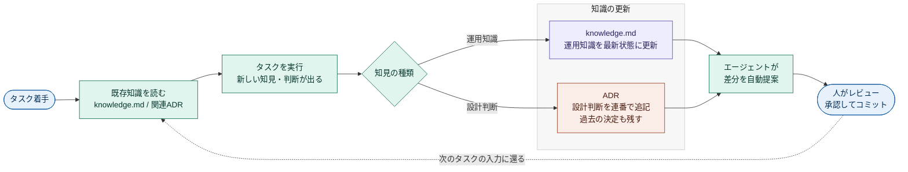

# 知識蓄積の運用ガイド

このプロジェクトでは、作業を通じて得たドメイン知識と設計判断を **リポジトリ内に蓄積** している。
新しく参加した人がこの仕組みを運用できるよう、ここに運用ルールをまとめる。

## 全体像

- 知識ファイルを **書くのはAIエージェント**(Claude Code)。作業の中で更新する。
- **人間は差分のレビューと承認** を担う。自分でゼロから書く必要はない。
- エージェントが従う規範はリポジトリルートの `CLAUDE.md` に集約されている。
  このREADMEは、その運用を人間が理解・運用するための解説。
  運用ルール(knowledge.md / ADR の扱い)を変えるときは、規範の `CLAUDE.md` と
  この解説の両方を更新する(同じルールを読者別に書き分けているため)。

知識を中央のドキュメントツールに切り出さず、コードと同じGitリポジトリに置くのが方針。
コードを読むエージェントが知識へ自然に辿り着け、レビューもPRの中で完結する。

## 知識が蓄積されるサイクル

タスクをこなすたびに知識が貯まり、それが次のタスクの入力に還る。



## ファイルの場所と役割

| ファイル | 役割 |
|---|---|
| `CLAUDE.md`(ルート直下) | エージェント向けの運用規範。毎セッション読まれる |
| `docs/knowledge.md` | 案件固有の生きた知識 |
| `docs/adr/` | 設計意思決定の記録(ADR)。`0000-template.md` は雛形 |

配置はプロジェクトの構成に合わせて変えてよい。変えた場合の実際のパスは `CLAUDE.md` の
「知識ファイルの場所」に書かれており、エージェントはそれを正として参照する。

### knowledge.md — 案件固有の生きた知識

そのプロジェクトでしか通用しないドメイン知識を蓄積する。

- このクライアントの仕様の癖、業務ルール、用語
- APIや外部システムの制限・ハマりどころ
- デプロイや運用の注意点

**常に最新であってほしい知識** を置く。古くなった記述はAIが上書きして最新化し、履歴は残さない
(履歴はGitが持つ)。コードを読めば分かることや一度きりの作業ログは書かない。

### docs/adr/ — 設計意思決定の記録(ADR)

「なぜその設計を選んだか」を、決定ごとに1ファイル・連番(`0001-xxx.md`, `0002-xxx.md` …)で残す。

- **ADRはエージェントが自走で起こす。** 設計上の意思決定があれば、エージェントが
  ドラフトを書いて差分提案する。人は **PR/差分のレビューで内容を確認** し、
  誤りや早すぎる判断があればコミット前に修正させる。
- **コミット済みのADRは書き換えない。** 決定を覆すときは新しいADRを起こし、
  古いものの Status を `Superseded` にする。これで判断の変遷が辿れる。

### knowledge.md と ADR の使い分け

判断基準は **「将来この決定を覆すとき、過去の理由を残す必要があるか?」**。

| | knowledge.md | ADR |
|---|---|---|
| 性質 | 常に最新化する運用知識 | 時系列で積み上げる意思決定 |
| 古くなったら | 上書きする | 書き換えず Superseded にする |
| 例 | 「このAPIは謎の制限がある」 | 「DBにPostgreSQLを選んだ理由と却下案」 |

## 運用の流れ

新しく参加した人がやることは、実質これだけ。

1. **作業前** — エージェントは `docs/knowledge.md` と関連ADRを読んでから着手する。
   人間も、そのプロジェクトの前提を掴みたいときはこの2つを読む。
2. **作業中・完了時** — エージェントが知識やADRの更新差分を提案する。
3. **レビュー** — 人間が差分を確認する。事実誤認やノイズがあれば修正させてからコミットする。
   ADRはコミットすると本文が確定する(以後は書き換えない)ので、レビューはコミット前に行う。

書く負担がないので知識蓄積が形骸化しない。レビューだけ怠らなければ仕組みは回る。

## オプション: Codex など他エージェントからも参照する

正本は `CLAUDE.md`。Codex など `AGENTS.md` を読むエージェントも併用したい場合は、
`AGENTS.md` を `CLAUDE.md` へのsymlinkにすると同じ規範で運用できる。基本フローには含めないので、
必要なプロジェクトでだけ実行する。

```bash
# CLAUDE.md を正本として AGENTS.md をsymlinkで同一実体にする
ln -s CLAUDE.md AGENTS.md
```
